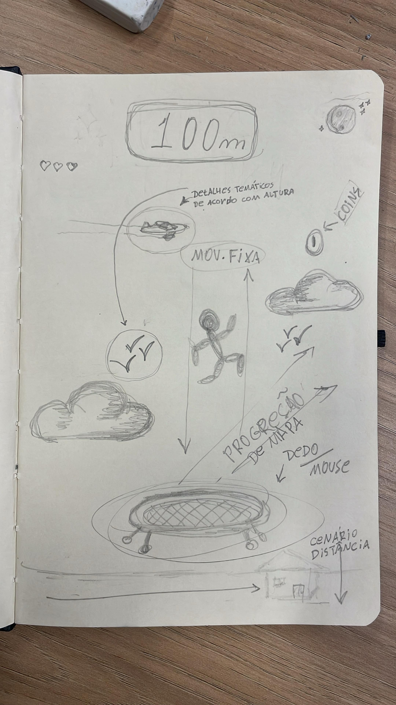
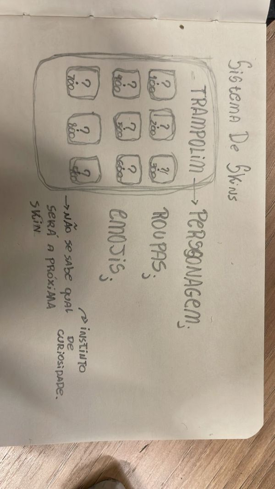
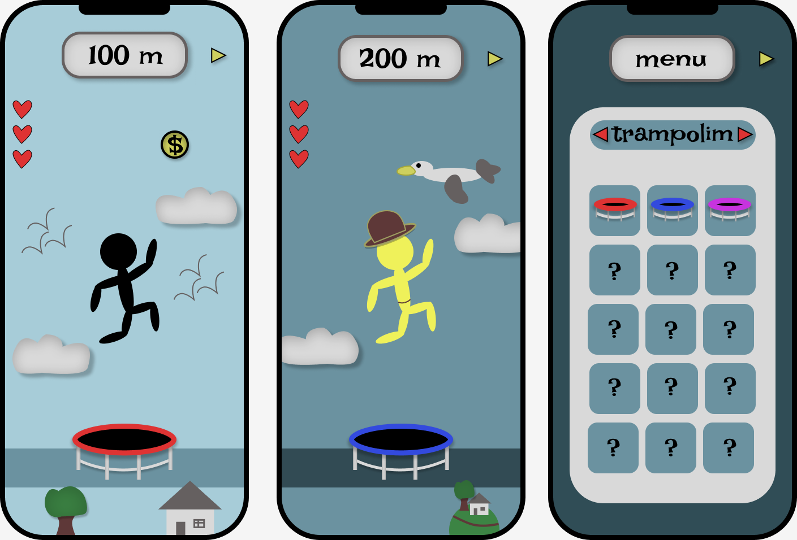

# jogo_pong
# Relatório - Reinventando Pong

## 1. Introdução  

  Com base nos estudos solicitados sobre o Framework MDA, Concept Art e Game Design, tivemos que explorar a fundo a história, estrutura e funcionamento do jogo Pong Game. Diante disso, recebemos o desafio de replicar as características básicas do jogo, mantendo sua essência. No entanto, tínhamos o dever de reestruturá-lo utilizando metodologias de UX Design para jogos, tornando-o mais interativo e cativante.
 Decidimos explorar as metodologias do UX Desing que cativam o cliente a experiencia do produto, entao nossas mudanças foram voltadas para estimular as emoções dos usuários. 
 Após a aula que tivemos com a professora de Desing, Fabiana Martins, adquirimos muitas inspirações que nos insentivaram a alterar alguns aspectos como: cenário dinâmico, movimentção/mecânica, atchiviments, sistema de conquista, inventario, progreção de dificuldade e sons.

---

## 2. Pesquisa e Análise Inicial  
### Principais Características

- **MECÂNICA**
    - O “Pong” é um jogo com uma tela que simula uma mesa de tênis virtual em que as “raquetes” são duas barras (uma no lado direito e outra na lado esquerdo);
    - Os jogadores tem como objetivo evitar que a bolinha ultrapasse a sua “raquete”, caso isso aconteça, o jogador adversário ganha um ponto;
    - A “raquete” é controlada pelo jogador com as telas cima e baixo (setinha para cima, setinha para baixo e W, S);
    - O jogo tem um sistema de pontuação que a cada vez que o jogador não consegue “rebater” a bolinha, o jogador adversário ganha um ponto. O jogo acaba quando o primeiro jogador faz 10 pontos;
    - A bolinha tem uma física em que quando ela bate na raquete de um jogador ela é ricocheteada na direção do outro jogador no mesmo ângulo em que ela bateu na raquete, caso o jogador não rebata a bola, a bolinha bate na parede e o ponto é contabilizado.
    
- **DINÂMICA**
    - O  jogador se adapta à jogabilidade compreendendo os padrões de movimento da bola e desenvolvendo suas habilidades com as “raquetes”;
    - De acordo com a duração da partida o jogador se entretém com o aumento progressivo da velocidade cuja a “bola” se move;
    - O jogo disponibiliza dois modos de competição, uma versão multiplayer e outra contra o computador (ambos possuem a possibilidade de escolher 3 níveis de dificuldade, as quais determinaram a velocidade da “bola” );
    - Placar de pontuação disponível na tela do jogo com contagem máxima de 10 pontos.
    
- **ESTÉTICA**
    - O jogador acompanha o placar do jogo com um objetivo de de realizar 10 pontos, possibilitando que ele administre seu foco e habilidades durante a partida dependendo da sua vantagem ou desvantagem sobre o oponente;
    - O jogo possibilita que o jogador se entretenha com um BOT, como adversário ou ate mesmo a possibilidade de jogar com outro player, produzindo uma experiencia imersiva como competitividade;
    - De acordo com a duração da partida o jogador se entretém com o aumento progressivo da velocidade cuja a “bola” se move;
    - É um jogo prático com gráficos simples.

- ### O  QUE TORNA O PONG ENVOLVENTE E JOGÁVEL?
    - É um jogo com regras simples e fácil de ser jogador;
    - Ajuda no desenvolvimento do reflexo dos jogador;
    - É um jogo dinâmico em que a cada “rebate” na bolinha a velocidade dela vai aumentando, o que estimula o jogador a continuar a se desafiando;
    
- ### ELEMENTOS PRINCIPAIS DE DIVERSÃO E DESAFIO
    - O fato que torna o jogo divertido é que a cada vez que os jogadores jogam eles passam a adquirir mais controle dos movimentos e começam a sentir uma sensação de evolução, um ponto muito importante que estimula os jogadores a continuarem buscando evolução dentro do jogo;
    - Como o Pong é um jogo dinâmico em que a cada vez que a bolinha é ricocheteada a sua velocidade aumenta, o jogador se sente desafiado e isso o estimula para ficar cada vez melhor no jogo.

---

## 3. Proposta de Reinvenção  

*- **Tema e Ambientação:** 
    
  -O contexto do jogo foi alterado, renomeado como "Pong to Sky", o jogo agora consiste em apenas uma "paleta" que agora será uma cama elástica. Também alteramos a "bola" do jogo original por um personagem, o "stick guy";
  -A tela inicial do jogo possui a ilustração do "Stick guy" em seu jardim de casa, em frente ao seu "pula-pula". o cenário é dinamico, então enquanto o usuário nao clicar no "pula-pula" para inicar o mapa, o céu estará cheio de movimentações como aves, aviões, nuvens, estrelas entre outros.  *

*- **Personagens ou Elementos Visuais:**
    
  -Realizamos uma alteração completa do cenário, personagem e "raquetes";
  -A antiga "bola" do jogo Pong agora é um personagem stick guy";
  -O jogo possuirá apenas uma "aleta" que agora será uma cama elastica;
  -O cenario agora é dinamico, de acordo com a progreçao do usuario durante na partida o persnagem passara por diversas ambientacoes caracteristicas da altura que o condiz no momento, tendo como exemplo, ao atingir 9400 m, altura padrao de voo para aeronaves, diversas aeronaves irao passar ao fundo da tela; 
  -Agora teremos um sistema de conquista, ao qual funcionara de acordo com a altura maxima atingida pelo usuario, assim, diponibizando a opçao de alterar as skins do personagem, skins do "stick guy", emojis e skins para a cama elastica;
  -Adicionamos os "coins", moedas que irao aparecer aleatoriamente no percorrer do jogo que contaram como pontos extra, que farao o personagem pular mais alto quando coletadas;
  -Inimigos foram adicionados no jogo, durante a partida, inimogos como passaros, avioes, aliens (varia de acordo com a altura) irao atravessar o mapa no eixo.x em ambas as direcoes (direita e esquerda).*
    
*- **Mudanças na Mecânica:**
    
  -A ideia de Ping-Pong foi alterada porem mantendo a caracteristica central de que deve usar a "paleta" para nao perder o jogo, agora no nosso jogo, devemos subir o mais alto possivel, sem deixar que nosso personagem caia do trampolim ou ser atingido por inimgos durante o jogo e perca suas tres vidas;
  -O placar de pontos agora é um contador, que mostra a altura do personagem;
  -O usuario ira movimentar o personagem no eixo.x, e tera que administrar seus movimentos pois o personagem tera uma velocidade dinamica no eixo.y que progredira durante o jogo;
  -A cama elastica movimentara no eixo.x, tambem tera uma velocidade dinamica que almenta durante o jogo;
  -As coins iram almentar quantos metros o jogador pula, o ajudando a progredir no jogo, 
  -Contador de vidas. 
*

*- **Objetivo da Reinvenção:** 
    -Nosso jogo busca estigar o instinto de curiosidade, disponibilizando um jogo completamente dinamico, criado para ofercer multiplos cenarios, desafios, 

---

## 4. Tela Digital do Jogo  

*- Como o concept foi adaptado para o formato digital?*
    
  - Nós utilizamos o Figma para a criação do jogo no formato digital e descobrimos a ferramenta para podermos refinar o esboço que foi criado com a concept art. Desenhamos 3 telas do nosso jogo, duas delas representam o jogo em funcionamento em que de acordo com a progressão da altura que o personagem vai alcançando no jogo, o fundo vai se transformando, o que deixa o jogo mais interativo e dinâmico, estimulando o jogador a continuar jogando para explorar as novas telas. Também criamos uma tela de skins no formato digital, com isso a ideia ficou mais clara e mais fácil de entender o que o jogo quer passar, com a utilização do caracter "?" o jogador fica curioso para descobrir qual será a próxima skin que ele irá ganhar e para isso ele terá que continuar jogando o jogo. 

*- Quais elementos visuais foram aprimorados?*
    
  - Ao tornar a concept art uma realidade no Figma, a interface do jogo ficou mais organizada e limpa, facilitando o usuário a entender o que ele jogará. Também aprimoramos o cenário e os ícones visuais, todos foram pensados em expressar profundidade e trazer vida para o jogo, o cenário foi pensado em mostrar que de acordo com a altura que o jogador atinge o mapa vai evoluindo junto, indicando que o personagem está evoluindo no jogo, já os ícones ficaram mais animados e estimulam a explorar o jogo.

*- O uso de cores, formas e layout foi pensado para reforçar que aspectos do jogo?*  
    
  - As cores sutis e suaves no fundo da tela destacam a sensação de progressão de altura e garantem que o jogador sinta que ele está progredindo de acordo com a altura que ele está atingindo. Os ícones e possuem formas simples e cores chamativas para tornar o design intuitivo garantindo que o jogador entenda rapidamente o jogo. A possibilidade da personalização do personagem e do trampolim com cores diferentes também foram pensadas para chamar a atenção do usuário nos elementos principais do jogo, o próprio jogador e o trampolim que é aonde ele ficaram pulando. Com isso, a escolha de cores suaves no fundo, ícones simples e chamativos e os elementos principais do jogo em destaque, contruibuem para que o usuário entenda o jogo de uma maneira simples e consiga se entreter com a mudança do cenário estimulando-o a continuar a jogar.  

---

## 5. Reflexão e Aprendizados  
*Cada membro da dupla deve responder individualmente:* 

### MARCELA COSTA
**1. Quais foram os maiores desafios enfrentados durante o processo de criação?**
   
   O maior desafio foi definir apenas uma ideia, pensamo em várias possibilidades para reinventar o Pong, mas só poderiamos realizar uma, então selecionamos o que concordamos no que seria mais interessante e chegamos no resultado final. Outro desafio que enfrentei foi me desafiar no Figma, eu nunca tinha utilizado a ferramenta e decedi me desafiar, no começo tive um pouco de dificuldade, mas no meio do processo começei a gostar bastante e consegui realizar a tarefa.
   
**2. Que habilidades foram desenvolvidas ou aprimoradas ao longo da atividade?**

   Consegui desenvolver a minha habilidade de tomada de decisão por conta do pouco tempo que tivemos para esboçar a ideia e chegar em um resultado final, também desenvolvi a minha habilidade de pesquisa ao realizar uma análise completa do Pong de acordo com MDA e aprendi a mexer e utilizar o Figma.

### ARTHUR MARQUES
1. Quais foram os maiores desafios enfrentados durante o processo de criação?
2. Que habilidades foram desenvolvidas ou aprimoradas ao longo da atividade? 

---

## 6. Referências (se houver)  
Caso tenha utilizado referências externas, inclua aqui as fontes consultadas.  

---

**📝 Formato de Entrega:**  
- O relatório pode ser submetido no **GitHub** em **Markdown** `.md` ou como **PDF** `.pdf` **compartilhado via Drive**.  
- **Nome do arquivo:** `RelatorioPong_Nome1-Nome2`  

📌 **Prazo de entrega:** Sexta-feira, às 23h59.
